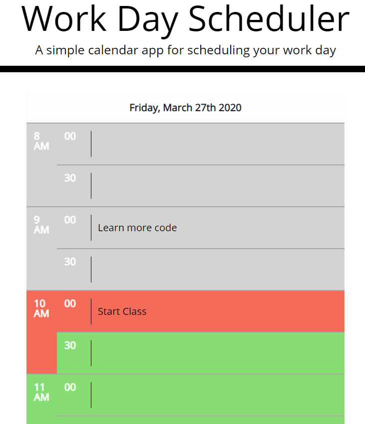

# Work Day Scheduler
The Work Day Scheduler provides the user the ability to schedule a single work day in 30 minute increments starting at 8 AM and ending at 6PM (shows 5:30 PM is the last time you can schedule). The current date is displayed at the top of the scheduler.  The current time is in an orange-red color, past-time is in a grey color and the future will be in green.

The application utilizes full responsiveness on any device with a very clean minimalistic look.

The user can type in any space or remove any information.  The information is automatically saved so when the user comes back to the application, their information is present.  I chose to save automatically because users today expect their information to be saved automatically in case they forget to save their information.  Employees with busy schedules will definitely forget to save.

## Site Picture
Link to see it work in screencastify 
https://drive.google.com/file/d/1ZkL1HdhAc-_yGu3GSjojVl1IB1lhNPtS/view



## Technology Used
jQuery - used for DOM manipulation and storing data to local storage.  Connected to BootstrapCDN
JavaScript - 
HTML - Displays the DOM
CSS - Sets the formating
Moment.js - access time functions
Bootstrap - creates a responsive site
Google Fonts - Open Sans font
FontAwesome API
Git and GitHub for version control and repository.

## How It Works
The Scheduler utilizes a hardcoded table into the index.html file.  Each table row has an ID attribute resembing the time as a number.  That id is used to compare the table row with the current time to determine what color to make the row.

The table data field utilizes an Input field to write your activities into each 30 minute time slot.  Whether you add or remove information, the changes are saved to LocalStorage as soon as you leave the field with a TAB or CLICK away from the field.

The input field as an ID resembling the time with an m at the end of the minutes.  This attirbute is used to store and collect the data from LocalStorage.

Code Snippet
Including the Init function for getting the information from Local Storage, The function for setting the colors.

JavaScript
```
function setPlannerColors() {
    var trArr = [];

    // Grabbing all the table rows in the table body which we will use to pull their id
    $("tbody tr").each(function() {
        //Putting the table row ID into a string
        var str = this.id;
        // Use *1 to convert to a string because parseInt uses only whole numbers
        // Need the string to be a number to compare to the hour.
        var num = str*1;
        trArr.push(num);
    });

    // get the hour and minutes then make it a number
    var time = (moment().format("Hmm"));
    time = parseInt(time);

    // enumerate through the tr time array and compare it to current time
    for (var i = 0; i < trArr.length; i++) {
        var trEl = "#"+trArr[i];
        presentTime = time - 29;

        console.log("=========================")
        console.log("Time is a "+typeof(time) + " " + time);
        console.log("trArr is a " + typeof(trArr[i]) + " " + trArr[i]);
        console.log("presentTime " + typeof(presentTime) + " " + presentTime);

        if (trArr[i] < time) {
            $(trEl).addClass("past"); 
        
        if (trArr[i] > presentTime ) {
            $(trEl).addClass("present");
        } 
        
        } else if (trArr[i] > time) {
            $(trEl).addClass("future"); 
        }
    }
}

// var init = function
function init() {
    // Populate the calendar with stored data from previous session between 8AM and 5PM (1700)
    for (i = 8; i < 18; i++) {
        var time = i + "00m";
            // console.log("LocalStorage Time is: " + time);
        var timeData = localStorage.getItem(time);
        if (timeData !== null) {
            // console.log("LocalStorage Value for time: " + timeData);
            document.getElementById(time).value = timeData;
        }
        var time = i + "30m";
            // console.log("LocalStorage Time is: " + time);
        var timeData = localStorage.getItem(time);
        if (timeData !== null) {
            // console.log("LocalStorage Value for time: " + timeData);
            document.getElementById(time).value = timeData;
        }
    }
}

$(document).ready(function () {

    // Listens for a chonge on the INPUT tags and logs it to LocalStorage
    $("input").on("change", function(event){
        event.preventDefault();
        var plannerInput = $(this).val();
        var time = $(this).attr("id");

        localStorage.setItem(time, plannerInput);
    });

```

## Author Links
### Michael Downs
[LinkedIn](http://www.linkedin.com/in/michaeldownssj)  
[GitHub](https://chindowns.github.io/) 
